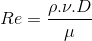

# Relatório do Grupo 13: #

### Nota da Etapa: 2,5 ###

### 1.1.	Integrantes do grupo: ###

  - Pedro Paulo de Souza Pereira - 12/0132737
  - Vinícius Tadeu Ciurlini - 16/0148103
  - Leonardo Julio Chagas Souza - 13/0143413
  
 ### 1.2.	Tema Escolhido ### 

-	Turbulência em Fluidos

 ### 1.3.	Objetivo do experimento ### 
 
- O experimento tem como objetivo verificar experimental o número de Reynolds de um flúido, variando a velocidade do fluído. 

 ### 1.4.	Escopo do experimento ### 

-	Será utilizado o adimensionamento de Navier-Stroke, secção 4.2.1 das notas de aula, para determinar o número de Reynolds do fluído variando a velocidade do fluído e com um corante para verificar o regime do fluído.

### 2.	Planejamento e Preparação: ###

### Nota da Etapa: 2,5 ###

### 2.1.	Teoria do experimento ###

Popularizado em 1883 por Osborne Reynolds, que demonstrou a existência de três tipos de escoamento, o Laminar, o transitório, e o regime turbulento.
No escoamento laminar o escoamento em camadas planas onde as moléculas do fluido estão aderentes umas nas outras, fluindo de maneira organizada onde: escoamento tranquilo e em camadas paralelas.
Já regime turbulento o escoamento é visto com oscilações das molécula em torno de seu próprio eixo, o que causa uma mistura intensa do liquido em si próprio e as camadas paralelas não irão existir mais.	
Reynolds nomeou seu número absoluto como sendo o número de Reynolds, que é, hoje, a base para estudo do comportamento de sistemas reais no escoamento.
O número de Reynolds é calculado a partir da equação:

    
O resultado dessa equação apresenta a característica do regime do fluído.
   - Re < 2000 - escoamento laminar
   - 2000 < Re < 2400 - Escoamento Transitório
   - Re > 2400 - Escoamento turbulento

### 2.2.	Procedimento experimento ###

  ### 2.2.1.	Matériais ###
  - Reservatório de água;
  - Tubo transparente;
  - Torneira;
  - Conectores;
  - Seringa com agulha;
  - Corante azul;
  - Água;
  
  ### 2.2.2.	Montagem ###
  
  A montagem do experimento consiste nos passos:
  1. Montagem do sistema reservatório-tubo-torneira;
  O sistema será montando conectando o reservatório de água a um tubo transpente de 1 metro e o tubo conectado à torneira, utilizando os conectadores.
  2. Preparação da água com coloração azul;
  Uma solução de água utilizando o corante azul será preparada e utilizando uma seringa será colocada aproximadamente 0,5 metro no tubo transparante.
  3. Inserção de lâmina de água no sistema reservátorio-tubo-torneira.
  Com intuíto de verificar o regime do sistema, a água azulada será inserida na seringa e depois inserida no tubo transparente para verificar como está o regime em termo da vazão.
  O tempo estimado para montagem do experimento é de 3 semanas, incluindo processo de compra de matérial e montagem do experimento com todas as correções executadas. O experimento será executado no Laboratório de Fluídos localizado na Universidade de Brasília Campus Gama.
  
  ### 2.3.	Cronograma ### 
  
  - Compra de matérial até 5/10/2018
  Responsável: Todos os membros do grupo.
  - Montagem do sistema reservatório-tubo-torneira até 12/10/2018
  Responsável: Leonardo Julio Chagas Souza;
  - Teste do sistema reservatório-tubo-torneira até 19/10/2018 
  Responsável: Leonardo Julio Chagas Souza;
  - Preparação da água com coloração azul
  Responsável: Pedro Paulo de Souza Pereira;
  - Preparação da lâmina de água no sistema reservátorio-tubo-torneira até 24/10/2018
  Responsável: Pedro Paulo de Souza Pereira e Vinícius Tadeu Ciurlini;
  - Teste da lâmina de água no sistema reservátorio-tubo-torneira até 28/10/2018
  Responsável: Pedro Paulo de Souza Pereira e Vinícius Tadeu Ciurlini;
  - Resultados do experimento até 01/11/2018
  Responsável: Todos os membros do grupo.
  
   ### 2.4.	Dados e Resultados ###
   
   Dado a formulação do núemro de Reynolds o único parâmetro a ser medido no experimento é a velocidade do fluído a partir da vazão, pois os outros dados já foram são conhecidos por medições experimental ou propriedades e característica do fluído ou matérial utilizado no experimento, pela lâmina de água de coloração azul será possível verificar visualmente o regime do fluído, e os resultados esperados é que para número de Reynolds calculado em função da vazão siga os seguinte comportamento:
    
   - Re < 2000 - escoamento laminar
   - 2000 < Re < 2400 - Escoamento Transitório
   - Re > 2400 - Escoamento turbulento
  

### 3.	Execução: ###

  -Integrantes do grupo;
  
    - Vinícius Tadeu Ciurlini - 16/0148103
    - Leonardo Julio Chagas Souza - 13/0143413
    
   -Divisão de tarefas
    - Compra de matérial até 31/10/2018
  Responsável: Vinicius Tadeu Ciurlini, Leonardo Julio Chagas Souza;
  - Montagem do sistema reservatório-tubo-torneira até 07/11/2018
  Responsável: Vinicius Tadeu Ciurlini;
  - Teste do sistema reservatório-tubo-torneira até 07/11/2018 
  Responsável:Vinicius Tadeu Ciurlini; Leonardo Julio Chagas Souza;
  - Preparação da água com coloração azul
  Responsável: Leonardo Julio Chagas Souza;
  - Preparação da lâmina de água no sistema reservátorio-tubo-torneira até 07/11/2018
  Responsável: Vinícius Tadeu Ciurlini; Leonardo Julio Chagas Souza;
  - Teste da lâmina de água no sistema reservátorio-tubo-torneira até 07/11/2018
  Responsável: Vinícius Tadeu Ciurlini; Leonardo Julio Chagas Souza;
  - Resultados do experimento até 07/11/2018
  Responsável: Vinicius Tadeu Ciurlini.
   
   Por conta da falta de um intergrante no grupo, datas tiveram que ser adiadas e tarefas redistribuidas.
   
   

O relatório desta etapa deverá ser feito no arquivo destinado a cada grupo neste repositório até o **dia 04/11/2018**, contendo os seguintes tópicos:

- Integrantes do grupo;
- Divisão de tarefas, conforme descrito na etapa 2. Se houver mudança em relação à etapa 2, uma justificativa deverá ser apresentada;
- Descrição dos procedimentos realizados, onde deverão ser apresentados:
  - Fotos do experimento montado;
  - Descrição de cada procedimento executado e justificativa, se houver diferença com a etapa 2;
  - Dados medidos;

### 4.	Análise e conclusão: ###

O relatório desta etapa deverá ser feito no arquivo destinado a cada grupo neste repositório até o **dia 18/11/2018**, contendo os seguintes tópicos:

-	Integrantes do grupo;
-	Apresentação dos dados medidos no experimento com seu respectivo erro experimental;
-	Apresentação de gráficos e sua respectiva análise;
-	Comparação dos resultados com a teoria envolvida;
-	Conclusões do experimento;
